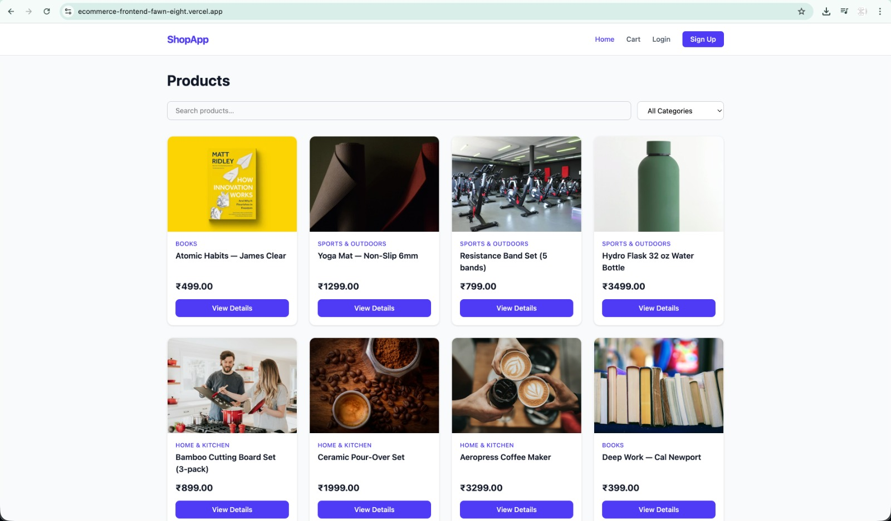
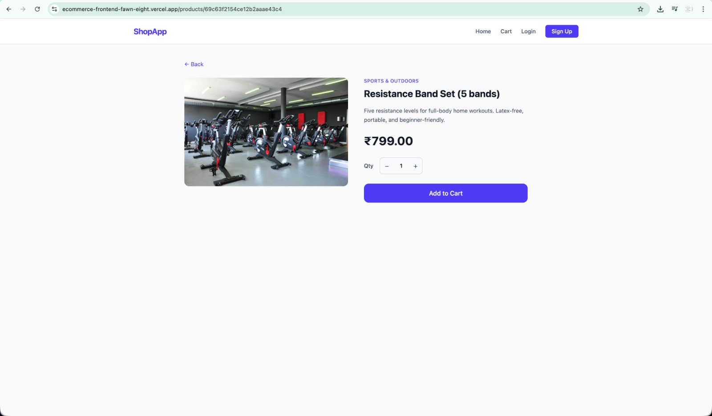
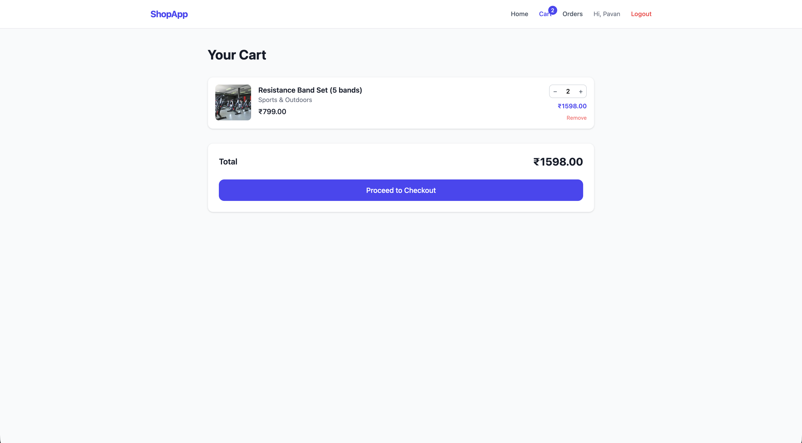
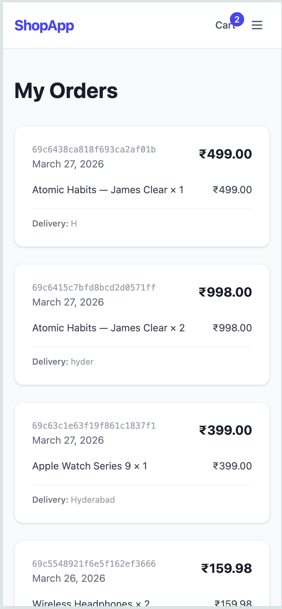
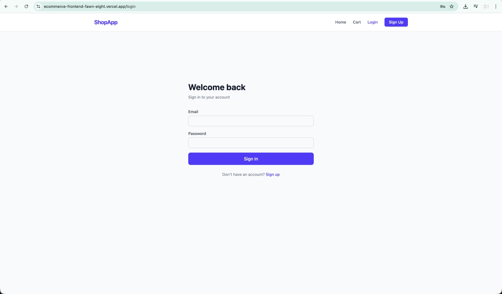
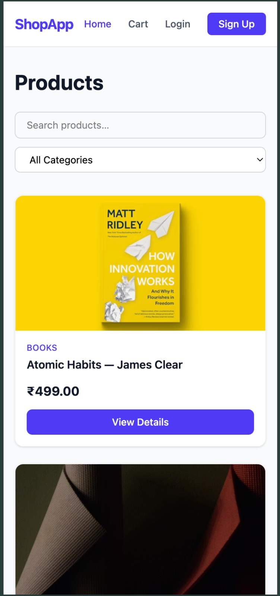

# ShopApp — Ecommerce Frontend

React + Vite + TypeScript SPA consuming the [ecommerce backend](https://ecommerce-backend-1suo.onrender.com).

## Screenshots

| Home | Product Detail |
|------|---------------|
|  |  |

| Cart | Orders |
|------|--------|
|  |  |

| Login | Mobile |
|-------|--------|
|  |  |

## Features

- Product browsing with search and category filter
- Product detail page with quantity selector and Add to Cart
- Cart with live badge, quantity controls, and totals
- JWT authentication (signup / login / logout)
- Protected Checkout and Order History pages
- Responsive Tailwind CSS UI

## Tech Stack

- React 18, Vite, TypeScript (strict: true)
- Tailwind CSS v4
- Axios (with auth interceptor)
- React Router v6
- Context API (auth + cart)

## Local Development

```bash
cp .env.example .env
npm install
npm run dev
# Opens at http://localhost:5173
```

## Build

```bash
npm run build
npx tsc --noEmit
```

## Deploy to Vercel

1. Push the repo to GitHub.
2. Import the project at vercel.com/new.
3. Add environment variable VITE_API_URL=https://ecommerce-backend-1suo.onrender.com
4. Deploy — Vercel auto-detects Vite (build command: npm run build, output: dist).

## Project Structure

```
src/
  types/index.ts          Shared TypeScript interfaces
  services/api.ts         Axios instance + auth interceptor
  context/
    AuthContext.tsx        Auth state, useAuth(), ProtectedRoute
    CartContext.tsx        Cart state, useCart()
  components/
    Navbar.tsx             Nav, cart badge, login/logout
    ProductCard.tsx        Product tile
  pages/
    Home.tsx               Product grid + filters
    ProductDetail.tsx      Single product + Add to Cart
    Cart.tsx               Cart items + checkout button
    Login.tsx
    Signup.tsx
    Checkout.tsx           Protected - place order
    Orders.tsx             Protected - order history
  App.tsx                  Providers + routes
```
